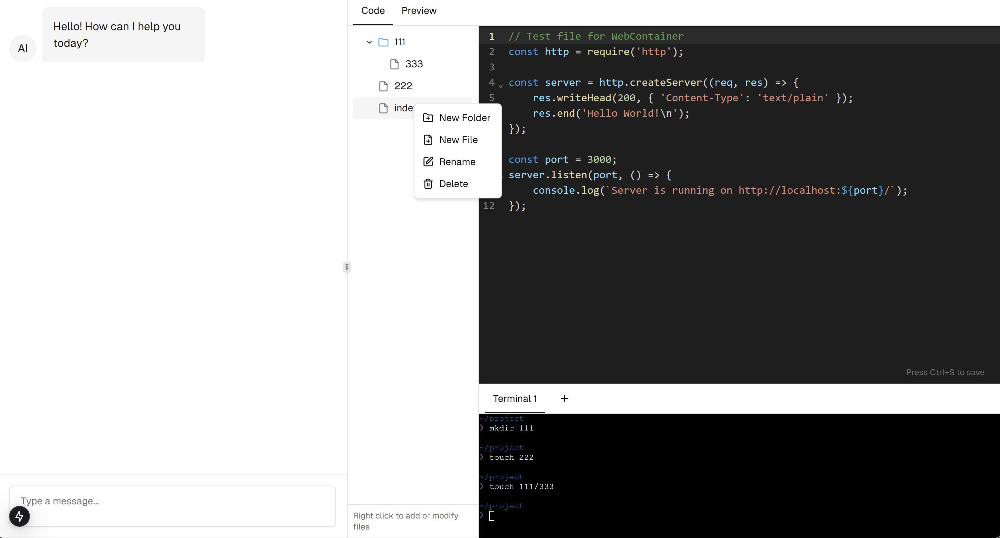

# chat2code-tutorial

[English](./README.md) | [中文](./README.zh.md)

This is a tutorial project based on T3 Stack, aiming to recreate the core functionality of bolt.new and help readers understand how to implement a chat-to-code application in the browser.

## Current Progress

We are currently in Phase 1 (Core Functionality Implementation, File System Operations), having completed:

- [x] File system API integration
- [x] Frontend file tree implementation

Next, we will implement AI interaction to modify workspace code through chat.

Follow HackerQED on [Jike](https://m.okjike.com/users/C4A32452-F5EE-48CF-B522-24D68EEA1662)/Twitter ([English](https://x.com/HackerQED)/[Chinese](https://x.com/HackerQEDCN)) for latest updates

## How to Learn

```bash
git clone https://github.com/HackerQED/chat2code-tutorial.git
cd chat2code-tutorial/3-fs-context-menu
pnpm i
pnpm dev

# visit http://localhost:3000/playground
```



## Next Steps

This is a progressive tutorial project, and we will implement the complete functionality through multiple phases:

- Phase 0: Environment Validation and Infrastructure
- Phase 1: Core Functionality Implementation [Current Phase]
- Phase 2: AI Integration
- Phase 3: State Management and Data Flow
- Phase 4: User Experience Optimization

Each phase will have detailed documentation and runnable code examples.

## Tech Stack

- Frontend Framework: Next.js (T3 Stack)
- AI Integration: OpenAI API
- Development Environment: WebContainer API
- Editor: CodeMirror
- Terminal: xterm.js
- State Management: Zustand
- UI Components: shadcn/ui
- Styling: Tailwind CSS
