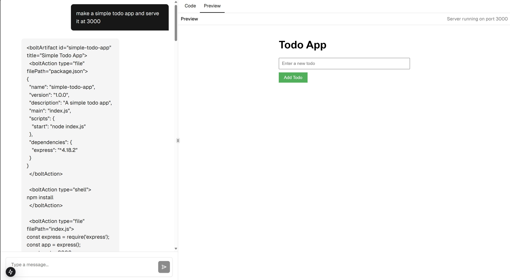
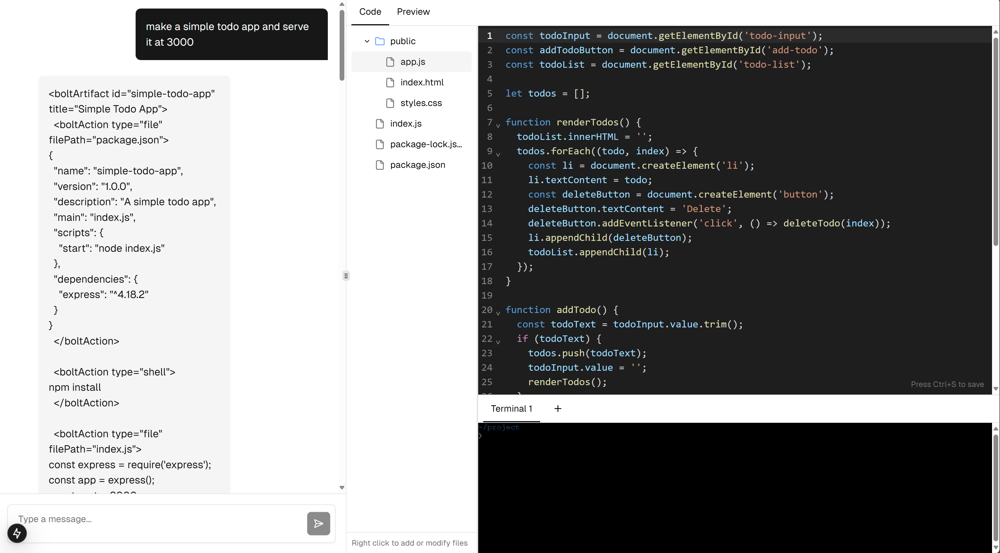

# chat2code-tutorial

[English](./README.md) | [中文](./README.zh.md)

这是一个基于 T3 Stack 的教学项目，目标是复刻 bolt.new 的核心功能，帮助读者理解如何实现一个浏览器中的 chat-to-code 应用。

## 当前进展

我们目前正处于 Phase 2 （AI 交互）阶段，主要完成了：

- [x] 实现 AI 交互，通过 chat 修改工作区的代码




关注 HackerQED 的[即刻](https://m.okjike.com/users/C4A32452-F5EE-48CF-B522-24D68EEA1662)/推特账号（[英文](https://x.com/HackerQED)/[中文](https://x.com/HackerQEDCN)），获得最新进展

## 如何学习

```bash
git clone https://github.com/HackerQED/chat2code-tutorial.git
cd chat2code-tutorial/4-action-parser-runner
pnpm i
pnpm dev

# visit http://localhost:3000/playground
```

## 下一步计划

这是一个渐进式的教学项目，我们将通过多个阶段逐步实现完整功能：

- Phase 0: 环境验证与基础设施
- Phase 1: 核心功能实现
- Phase 2: AI 交互【当前阶段】
- Phase 3: 状态管理与数据流
- Phase 4: 用户体验优化

每个阶段都会有详细的文档指导和可运行的代码示例。

## 技术栈

- 前端框架：Next.js (T3 Stack)
- AI 集成：OpenAI API
- 开发环境：WebContainer API
- 编辑器：CodeMirror
- 终端：xterm.js
- 状态管理：Zustand
- UI 组件：shadcn/ui
- 样式：Tailwind CSS
